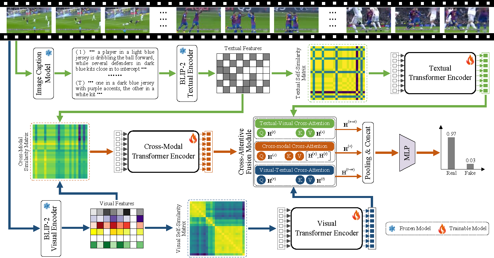

### [ATSS: Detecting AI-Generated Videos via Anomalous Temporal Self-Similarity](https://arxiv.org/abs/2604.04029)
Official PyTorch implementation of the paper: **"ATSS: Detecting AI-Generated Videos via Anomalous Temporal Self-Similarity"**.

[](https://arxiv.org/abs/2604.04029)
[](LICENSE)

---

## 📌 Introduction

<div align="justify">
AI-generated videos (AIGVs) have achieved unprecedented photorealism but follow deterministic <b>anchor-driven trajectories</b> (e.g., text or image prompts). This paper identifies a distinctive forensic fingerprint termed <b>Anomalous Temporal Self-Similarity (ATSS)</b>. Unlike real videos characterized by stochastic natural dynamics, AIGVs exhibit unnaturally repetitive correlations <b>within and across visual and semantic domains</b>. Our method, <b>ATSS</b>, exploits this insight via a <b>triple-similarity representation</b> comprising visual, textual, and cross-modal trajectories, which are further <b>integrated with a cross-attentive fusion mechanism</b> to effectively distinguish AIGVs from natural sequences.
</div>

<br>

<p align="center">
  
  <br>
  <em>Fig. 1: The overall framework of ATSS. </em>
</p>


---

## 🚀 News
* **[2026.04]** Inference code and Pre-trained models are released!

---

## 🛠️ Installation

### Environment
Ensure you have the required packages by running:
```bash
pip install -r requirements.txt
```


## 📈 Pipeline & Getting Started

### 1. Data Sampling & Feature Extraction
To evaluate videos using the ATSS framework, the input data undergoes the following pipeline:

* **Video Sampling**: Videos are decoded and uniformly sampled into $T$ frame sequences (e.g., $T=8$) to capture global temporal dynamics.
* **Image Caption Generation**: For each sampled frame, a detailed textual description is generated using a vision-language model (e.g., **BLIP-2**) to capture fine-grained semantic information.
* **Visual and Textual Features Extraction**: Both visual frames and their corresponding textual captions are mapped into a joint embedding space using pre-trained visual and textual encoders (e.g., **blip2-itm-vit-g**). These features are then saved as `.npy` files for subsequent similarity matrix construction.

> **Note**: The automated scripts for the sampling and extraction pipeline are currently being cleaned for release. **Coming soon!**

### 2. Testing & Evaluation
We provide our pre-trained model weights for evaluation. You can download the checkpoint here: [**best.pt**](https://drive.google.com/drive/folders/1WLbBHn46e4hyhoSiSkLQJFtmzEuORRWF?usp=sharing).

Once you have the extracted visual and textual features (in `.npy` format), run the evaluation script:

```bash
# Evaluate on test datasets (e.g., GenVideo, EvalCrafter, VideoPhy, VidProM)
python test.py --test_neg_path ./path_to_real_features --batch_size 256 --num_frames 8
```


### Citation 
```
@misc{wang2026atssdetectingaigeneratedvideos,
      title={ATSS: Detecting AI-Generated Videos via Anomalous Temporal Self-Similarity}, 
      author={Hang Wang and Chao Shen and Lei Zhang and Zhi-Qi Cheng},
      year={2026},
      eprint={2604.04029},
      archivePrefix={arXiv},
      primaryClass={cs.CV},
      url={https://arxiv.org/abs/2604.04029}, 
}
```


### Contact
If you have any questions, please feel free to contact: cshwang@comp.polyu.edu.hk


<details>
<summary>statistics</summary>


</details>


